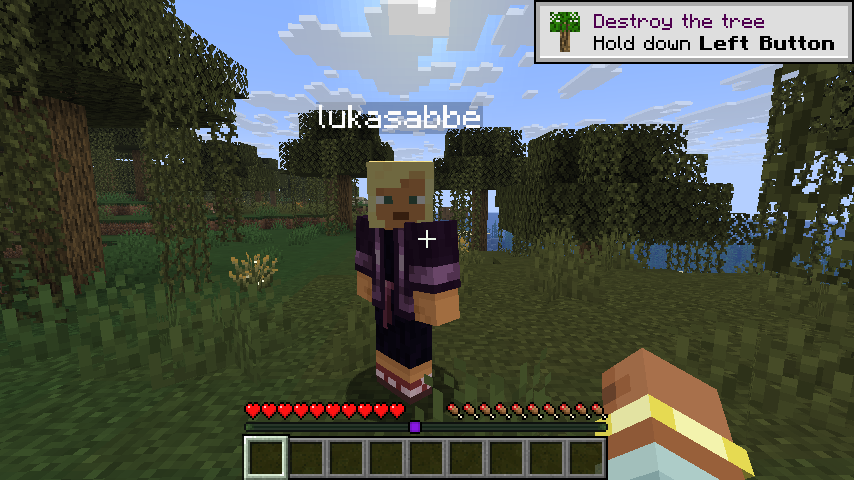
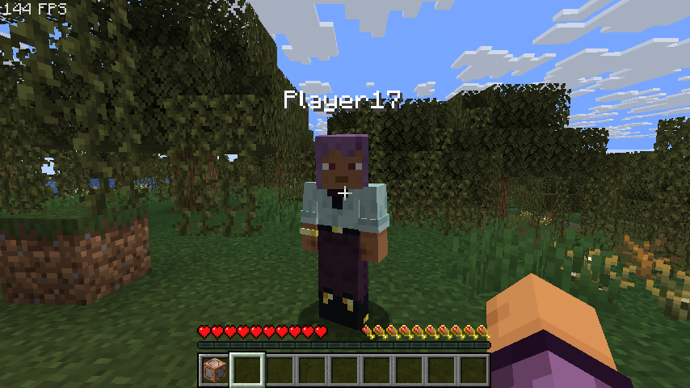

# Opt in locator bar

With this mod you as the player can opt in to be visible on the locator bar.

```
/locatorbar <disable | enable> this will enable/disable the locator bar for yourself
```

Example:
This user has locator bars enabled 

This user has locator bars disabled


# Looking for a server?
Get BisectHosting and save 25% off for new customers using code Lukas at checkout.
Thanks for your support — it helps me develop this and other mods I make!
#ad
[](https://bisecthosting.com/Lukas)
